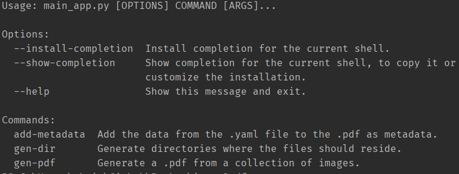

 <div id="top"></div>

<!-- PROJECT SHIELDS -->

<!-- PROJECT LOGO -->
<br />
<div align="center">
  <a href="https://github.com/christopher-chandler/i2pdf">
    
  </a>

![Version][Version-shield]  [![MIT License][license-shield]][license-url] ![update][update-shield]

[![Stargazers][stars-shield]][stars-url]

![Windows][windows-shield] ![Mac][Mac-shield]


<h3 align="center">i2pdf</h3>

  <p align="center">
    i2pdf combines multiple images together to create a single .pdf.
    <br />
    <br />
    <a href="https://github.com/christopher-chandler/i2pdf/issues">Report Bug</a>
    ·
    <a href="https://github.com/christopher-chandler/i2pdf/issues">Request Feature</a>
  </p>
</div>


<!-- TABLE OF CONTENTS -->
<details>
  <summary>Table of Contents</summary>
  <ol>
    <li>
      <a href="#about-the-project">About The Project</a>
      <ul>
        <li><a href="#built-with">Built With</a></li>
      </ul>
    </li>
    <li>
      <a href="#getting-started">Getting Started</a>
      <ul>
        <li><a href="#prerequisites">Prerequisites</a></li>
        <li><a href="#installation">Installation</a></li>
      </ul>
    </li>
    <li><a href="#usage">Usage</a></li>
    <li><a href="#roadmap">Roadmap</a></li>
    <li><a href="#contributing">Contributing</a></li>
    <li><a href="#license">License</a></li>
    <li><a href="#contact">Contact</a></li>
    <li><a href="#acknowledgments">Acknowledgments</a></li>
  </ol>
</details>

<!-- ABOUT THE PROJECT -->
## About The Project

<div align="center">
  <a href="https://github.com/christopher-chandler/i2pdf">
    
  </a>
</div>
<p align="right">(<a href="#top">back to top</a>)</p>


### Built With

A list of frameworks that were used in developing the program. 
* [typer](https://typer.tiangolo.com/)
* [PyYAML](https://pypi.org/project/PyYAML/)
* [Pillow](https://pillow.readthedocs.io/en/stable/)
* [PyPDF2](https://pythonhosted.org/PyPDF2/)

<p align="right">(<a href="#top">back to top</a>)</p>


<!-- GETTING STARTED -->
## Getting Started

i2pdf was created with python 3.9 and should be used with this version of python.


### Prerequisites


#### Standard Libraries
The following standard libraries are used. 
```
os
platform
```

#### Pip

The following dependencies are necessary.
```
typer~=0.4.0
PyYAML~=6.0
Pillow~=9.0.1
PyPDF2~=1.26.0
```

### Installation

To install i2pdf, enter the following command in the command prompt:

```
pip install i2pdf
```


If the installation was successful, then the following text 
should appear in the terminal 

#### Mac example:
```
Usage: main_app.py [OPTIONS] COMMAND [ARGS]...

Options:
  --install-completion [bash|zsh|fish|powershell|pwsh]
                                  Install completion for the specified shell.
  --show-completion [bash|zsh|fish|powershell|pwsh]
                                  Show completion for the specified shell, to
                                  copy it or customize the installation.

  --help                          Show this message and exit.

Commands:
  add-metadata  Add the data from the .yaml file to the .pdf as metadata.
  gen-dir       Generate directories where the files should reside.
  gen-pdf       Generate a .pdf from a collection of images.

```
 

<p align="right">(<a href="#top">back to top</a>)</p>


<!-- USAGE EXAMPLES -->
## Usage

### Commands

#### add-metadata

```
Arguments:
  [PDF_NAME]     The name of the .pdf that should have metadata added.
                 [default: ]

  [CONFIG_NAME]  The name of the .yaml file which contains the config data.
                 [default: ]
```

Example:
```
i2pdf add-metadata test.pdf test.yml
```

If you wish to have metadata added to the .pdf,
you must store it in a .yaml or .yml file. 

The format of this file should be as follows:
```
/author: test author
/keywords: test keywords
```

This file should be stored in the config folder. 

#### gen-dir 
Before you can combine the images to a .pdf,
you must first generate the necessary folders. 
It is possible to do this by hand, 
but this command automatically generates the folders 
in the directory in which i2pdf was called. 

The following empty folders are generated:

| Folder      | Description |
| ----------- | ----------- |
| config      | this contains the .yaml files.       |
| images   | the image files that are to be combined to a pdf        |
| pdfs      | the generated .pdf files.       |
| results | the pdf files that had metadata added .       |

#### gen-pdf 
```
Arguments:
  [SAVE_NAME]  Enter the save name of the .pdf file  [default: generated]
```

Example:
```
i2pdf gen-pdf testfile
```
Place the images in this file that are to be combined to a .pdf file.
You have the option of specifying a name for the file being generated.
if no file is added, then it is automatically called generated 


<!-- ROADMAP -->
#### Roadmap

- [ ] adding the ability to add a table of contents to the generated pdf.
 

See the [open issues](https://github.com/christopher-chandler/i2pdf/issues) for a full list of proposed features (and known issues).

<p align="right">(<a href="#top">back to top</a>)</p>


<!-- CONTRIBUTING -->
## Contributing

Contributions are what make the open source community such an amazing place to learn, inspire, and create. Any contributions you make are **greatly appreciated**.

If you have a suggestion that would make this better, please fork the repo and create a pull request. You can also simply open an issue with the tag "enhancement".
Don't forget to give the project a star! Thanks again!

1. Fork the Project
2. Create your Feature Branch (`git checkout -b feature/AmazingFeature`)
3. Commit your Changes (`git commit -m 'Add some AmazingFeature'`)
4. Push to the Branch (`git push origin feature/AmazingFeature`)
5. Open a Pull Request

<p align="right">(<a href="#top">back to top</a>)</p>


<!-- LICENSE -->
## License

Distributed under the MIT License. See `LICENSE` for more information.

<p align="right">(<a href="#top">back to top</a>)</p>


<!-- CONTACT -->
## Contact

Christopher Chandler - christopher.chandler@outlook.de

Project Link: [https://github.com/christopher-chandler/i2pdf](https://github.com/christopher-chandler/i2pdf)

<p align="right">(<a href="#top">back to top</a>)</p>


<!-- ACKNOWLEDGMENTS -->
## Acknowledgments

/


<p align="right">(<a href="#top">back to top</a>)</p>


<!-- MARKDOWN LINKS & IMAGES -->
<!-- https://www.markdownguide.org/basic-syntax/#reference-style-links -->

[contributors-shield]: https://img.shields.io/github/contributors/christopher-chandler/i2pdf?color=green&logoColor=%20
[contributors-url]: https://github.com/christopher-chandler/i2pdf/graphs/contributors

[stars-shield]: https://img.shields.io/github/stars/christopher-chandler/i2pdf?logoColor=yellow&style=social
[stars-url]: https://github.com/christopher-chandler/i2pdf/stargazers

[license-shield]: https://img.shields.io/github/license/christopher-chandler/i2pdf?color=yellow
[license-url]: https://github.com/christopher-chandler/i2pdf/blob/master/LICENSE

[download-shield]: https://img.shields.io/github/downloads/christopher-chandler/i2pdf/total

[windows-shield]:  https://img.shields.io/badge/Windows-Tested-purple 
[mac-shield]: https://img.shields.io/badge/Mac-Tested-purple
[version-shield]: https://img.shields.io/badge/Version-1.0.9-brightgreen
[update-shield]: https://img.shields.io/badge/Last_Updated-March_2022-blue